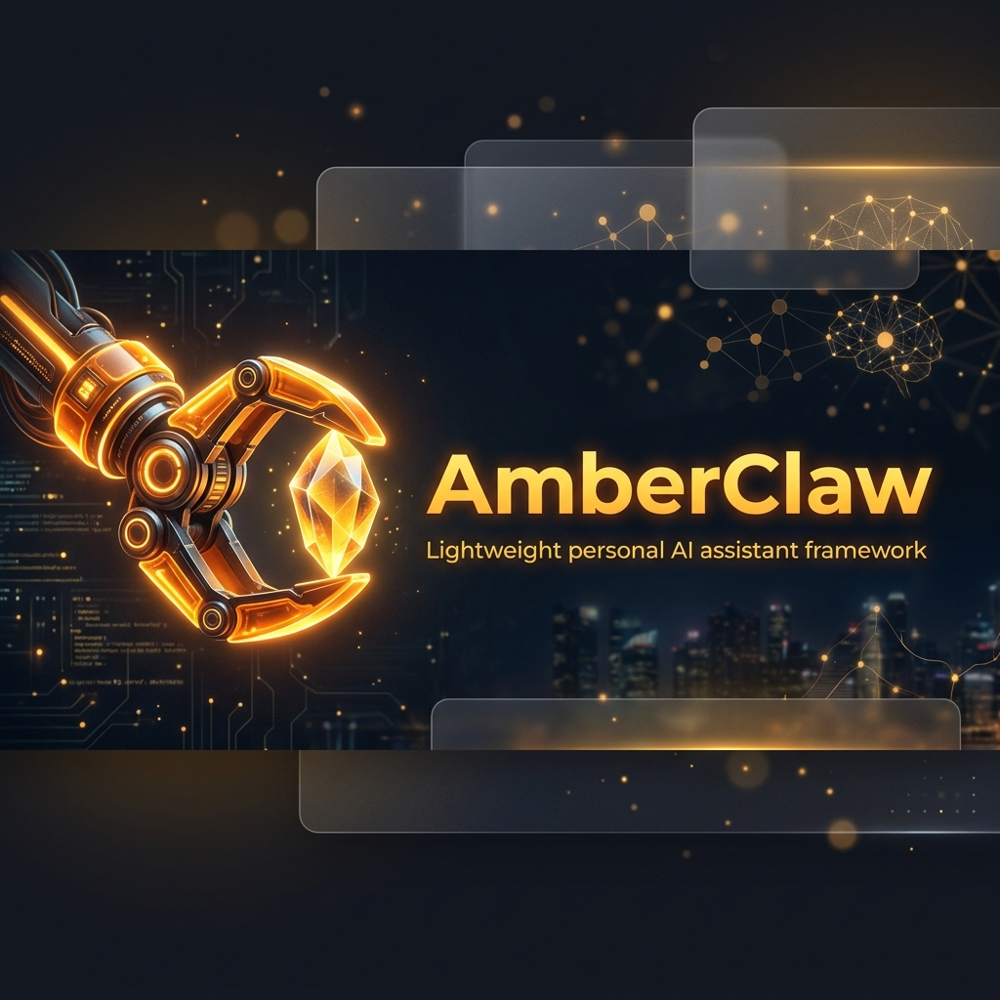
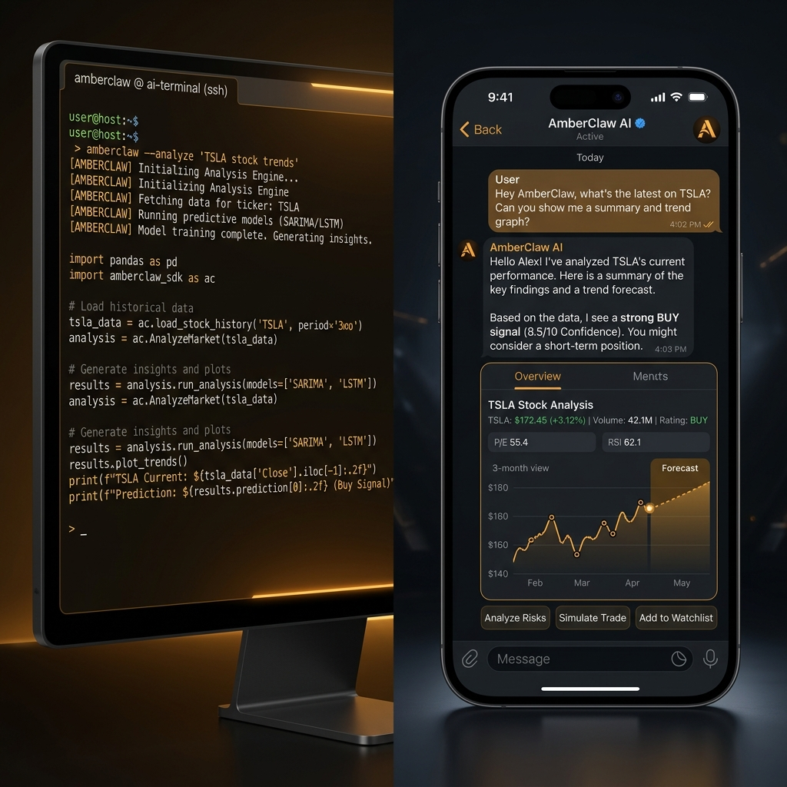

<div align="center">
  

  <p>
    <a href="https://github.com/krishujeniya/AmberClaw/actions/workflows/ci.yml"></a>
    <a href="https://pypi.org/project/amberclaw-ai/"></a>
    <a href="https://pepy.tech/project/amberclaw-ai"></a>
    <a href="https://hub.docker.com/r/krishujeniya/amberclaw"></a>
    
    <a href="https://github.com/krishujeniya/AmberClaw/commits/main"></a>
    <a href="./LICENSE"></a>
  </p>

  <p align="center">
    
  </p>

  <p>
    <a href="#-quick-start">Quick Start</a> •
    <a href="#-features">Features</a> •
    <a href="#-chat-integrations">Integrations</a> •
    <a href="#-configuration">Configuration</a> •
    <a href="#-docker">Docker</a> •
    <a href="#-contributing">Contributing</a>
  </p>
</div>

---

AmberClaw is a production-ready, minimal-footprint personal AI assistant built in roughly four thousand lines of Python. Hook it up to any LLM backend, wire it into the chat platforms you already use, and let it handle the rest.

## ✨ Features

| Category | What you get |
|----------|-------------|
| 🧠 **Agent Core** | Agentic loop with tool execution, sub-agent spawning, persistent memory, and a skills system |
| 🤖 **Multi-Provider** | Works with OpenRouter, Anthropic, OpenAI, Gemini, DeepSeek, Groq, Azure, vLLM, and others |
| 💬 **Chat Platforms** | Telegram, Discord, WhatsApp, Slack, Feishu, DingTalk, Email, QQ, Matrix |
| 🔌 **MCP** | Model Context Protocol support for plugging in external tool servers |
| ⏰ **Automation** | Heartbeat tasks, cron scheduling, automated workflows |
| 🐳 **Deployment** | Ready for Docker, docker-compose, systemd, and multi-instance setups |
| 🔒 **Security** | Allow-list access control, command filtering, path traversal guards |

## 🏗️ Architecture

<p align="center">
  
</p>

## 📦 Installation

### From source (recommended for hacking)

```bash
git clone https://github.com/krishujeniya/AmberClaw.git
cd AmberClaw
pip install -e .
```

### Via uv (fast)

```bash
uv tool install amberclaw-ai
```

### From PyPI

```bash
pip install amberclaw-ai
```

### Upgrade

```bash
# pip
pip install -U amberclaw-ai

# uv
uv tool upgrade amberclaw-ai
```

## 🚀 Quick Start

### Interactive setup (one command)

```bash
python setup.py
```

Walks you through provider configuration, chat integration, and launches AmberClaw.

### Manual CLI chat

```bash
amberclaw agent
```

### Launch the gateway (connects chat platforms)

```bash
amberclaw gateway
```

## 💬 Chat Integrations

| Platform | What you need |
|----------|--------------|
| **Telegram** | Bot token from @BotFather |
| **Discord** | Bot token plus Message Content intent enabled |
| **WhatsApp** | QR code scan (Node.js 18 or newer required) |
| **Slack** | Bot token and App-Level token with Socket Mode |
| **Feishu** | App ID and App Secret using WebSocket |
| **DingTalk** | App Key and App Secret via Stream Mode |
| **Email** | IMAP and SMTP credentials |
| **QQ** | App ID and App Secret |
| **Matrix** | User ID and Access Token |
| **Mochat** | Automatic setup through agent message |

<details>
<summary><b>Telegram Setup</b></summary>

1. Talk to `@BotFather` on Telegram and create a bot — grab the token.
2. Drop it into `~/.AmberClaw/config.json`:

```json
{
  "channels": {
    "telegram": {
      "enabled": true,
      "token": "YOUR_BOT_TOKEN",
      "allowFrom": ["YOUR_USER_ID"]
    }
  }
}
```

3. Fire up `amberclaw gateway`

</details>

<details>
<summary><b>Discord Setup</b></summary>

1. Head over to [discord.com/developers](https://discord.com/developers/applications) and create an application.
2. Flip on **MESSAGE CONTENT INTENT** under Bot settings.
3. Add this to your config:

```json
{
  "channels": {
    "discord": {
      "enabled": true,
      "token": "YOUR_BOT_TOKEN",
      "allowFrom": ["YOUR_USER_ID"],
      "groupPolicy": "mention"
    }
  }
}
```

4. Invite the bot to your server, then run `amberclaw gateway`

</details>

<details>
<summary><b>WhatsApp Setup</b></summary>

```bash
amberclaw channels login    # Scan the QR code
amberclaw gateway           # Start the gateway
```

Config snippet:
```json
{
  "channels": {
    "whatsapp": {
      "enabled": true,
      "allowFrom": ["+1234567890"]
    }
  }
}
```

</details>

<details>
<summary><b>Other Platforms</b></summary>

Check the full configuration reference in `~/.AmberClaw/config.json`. Every platform follows the same three-step pattern:
1. Get credentials from the platform
2. Add a channel entry with `enabled: true` and an `allowFrom` whitelist
3. Run `amberclaw gateway`

</details>

## ⚙️ Configuration

Config lives at `~/.AmberClaw/config.json`.

### Providers

| Provider | Use case | Get a key |
|----------|----------|-----------|
| `openrouter` | LLM access to all models | [openrouter.ai](https://openrouter.ai) |
| `anthropic` | Claude directly | [console.anthropic.com](https://console.anthropic.com) |
| `openai` | GPT directly | [platform.openai.com](https://platform.openai.com) |
| `gemini` | Gemini directly | [aistudio.google.com](https://aistudio.google.com) |
| `deepseek` | DeepSeek directly | [platform.deepseek.com](https://platform.deepseek.com) |
| `groq` | LLM plus Whisper | [console.groq.com](https://console.groq.com) |
| `azure_openai` | Azure OpenAI | [portal.azure.com](https://portal.azure.com) |
| `custom` | Any OpenAI-compatible endpoint | — |
| `vllm` | Self-hosted or local models | — |

<details>
<summary><b>Adding a New Provider</b></summary>

Two files to touch:

1. Register a `ProviderSpec` in `amberclaw/providers/registry.py`:

```python
ProviderSpec(
    name="myprovider",
    keywords=("myprovider",),
    env_key="MYPROVIDER_API_KEY",
    display_name="My Provider",
    litellm_prefix="myprovider",
)
```

2. Add the matching field to `ProvidersConfig` in `amberclaw/config/schema.py`:

```python
myprovider: ProviderConfig = ProviderConfig()
```

After that, environment variables, model prefixing, and status display all work out of the box.

</details>

### MCP (Model Context Protocol)

```json
{
  "tools": {
    "mcpServers": {
      "filesystem": {
        "command": "npx",
        "args": ["-y", "@modelcontextprotocol/server-filesystem", "/path/to/dir"]
      },
      "remote-server": {
        "url": "https://example.com/mcp/",
        "headers": { "Authorization": "Bearer xxxxx" }
      }
    }
  }
}
```

### Security

| Setting | Default | Purpose |
|---------|---------|---------|
| `tools.restrictToWorkspace` | `false` | Confine all tool operations to the workspace directory |
| `channels.*.allowFrom` | `[]` (blocks everyone) | Whitelist of permitted user IDs — use `["*"]` to open access |

## 💻 CLI Reference

| Command | What it does |
|---------|-------------|
| `amberclaw onboard` | Set up config and workspace |
| `amberclaw agent` | Start an interactive chat session |
| `amberclaw agent -m "..."` | Send a single message |
| `amberclaw gateway` | Launch the gateway for chat integrations |
| `amberclaw status` | Print current status |
| `amberclaw provider login openai-codex` | OAuth login flow |
| `amberclaw channels login` | Link WhatsApp via QR |
| `amberclaw channels status` | Show connection status for all channels |

## 🐳 Docker

### docker-compose

```bash
docker compose run --rm amberclaw-cli onboard   # First-time setup
vim ~/.AmberClaw/config.json                     # Add your API keys
docker compose up -d amberclaw-gateway           # Run the gateway
```

### Plain Docker

```bash
docker build -t amberclaw .
docker run -v ~/.AmberClaw:/root/.amberclaw -p 18790:18790 amberclaw gateway
```

## 🐧 Running as a Linux service

```ini
# ~/.config/systemd/user/amberclaw-gateway.service
[Unit]
Description=AmberClaw Gateway
After=network.target

[Service]
Type=simple
ExecStart=%h/.local/bin/amberclaw gateway
Restart=always
RestartSec=10

[Install]
WantedBy=default.target
```

```bash
systemctl --user daemon-reload
systemctl --user enable --now amberclaw-gateway
```

## 📁 Project Layout

```
amberclaw/
├── agent/          # Core agent logic (loop, context, memory, skills, tools)
├── bus/            # Message routing
├── channels/       # Chat platform integrations
├── cli/            # CLI commands
├── config/         # Configuration via Pydantic models
├── cron/           # Scheduled tasks
├── data/           # Data science module (optional)
├── engine/         # Execution engine
├── features/       # Feature modules
├── heartbeat/      # Proactive wake-up system
├── platforms/      # Platform adapters
├── providers/      # LLM provider registry
├── session/        # Conversation sessions
├── skills/         # Bundled skills
├── superpowers/    # Extended capabilities
├── templates/      # Prompt templates
└── utils/          # Utilities
```

## 🤝 Contributing

Pull requests are welcome. The codebase is intentionally compact and easy to read.

See [CONTRIBUTING.md](CONTRIBUTING.md) for the full guidelines.

### Roadmap

- [ ] Multi-modal inputs — images, voice, video
- [ ] Persistent long-term memory
- [ ] Multi-step planning and reflection
- [ ] Calendar, productivity, and third-party tool integrations
- [ ] Self-improvement through feedback loops

### Contributors

<a href="https://github.com/krishujeniya/AmberClaw/graphs/contributors">
  
</a>

## ⭐ Star History

<div align="center">
  <a href="https://star-history.com/#krishujeniya/AmberClaw&Date">
    <picture>
      <source media="(prefers-color-scheme: dark)" srcset="https://api.star-history.com/svg?repos=krishujeniya/AmberClaw&type=Date&theme=dark" />
      <source media="(prefers-color-scheme: light)" srcset="https://api.star-history.com/svg?repos=krishujeniya/AmberClaw&type=Date" />
      
    </picture>
  </a>
</div>

## 📄 License

[MIT](LICENSE) © 2026 Krish Ujeniya

---

<p align="center">
  <sub>AmberClaw is intended for educational, research, and technical exchange purposes</sub>
</p>
